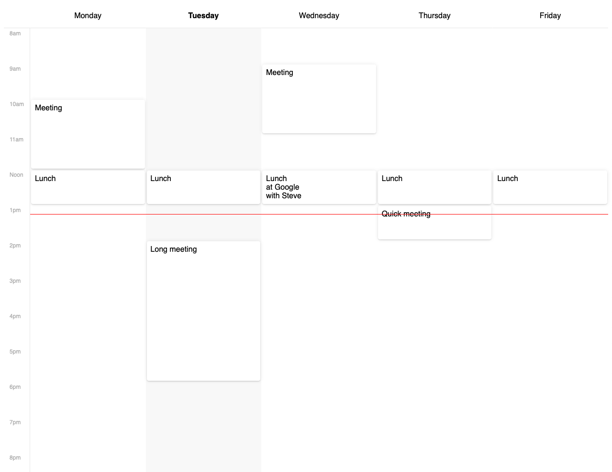

# CSSGridCalendar
Simple and Customizable Calendar UI built with CSS Grid.

Inspired by [a post on CSS Tricks](https://css-tricks.com/building-a-conference-schedule-with-css-grid/?unapproved=1733824&moderation-hash=3a4949bc8513fe0cd32e1a724d0d4510#comment-1733824), but doing a different approach.



---

## Basic usage

### Display events on the calendar

``` html
<div class="calendar">
  <div class="event tuesday from-10am to-11am">Meeting</div>
  <div class="event wednesday from-noon to-1pm">Lunch with client</div>
</div>
```

### Display custom labels for weekdays and time.

Labels are added manually to the HTML so you have full controll over what's displayed.

``` html
<div class="calendar">

  <!-- Time labels -->
  <div class="time from-9am">9am</div>
  <div class="time from-10am">10am</div>
  <div class="time from-11am">11am</div>
  <div class="time from-noon">Noon</div>
  <div class="time from-1pm">1pm</div>
  <div class="time from-2pm">2pm</div>
  <div class="time from-3pm">3pm</div>
  <div class="time from-4pm">4pm</div>
  <div class="time from-5pm">5pm</div>

  <!-- Weekday labels -->
  <div class="weekday"></div>
  <div class="weekday sunday">Sunday</div>
  <div class="weekday monday">Monday</div>
  <div class="weekday tuesday"><strong>Tuesday</strong></div>
  <div class="weekday wednesday">Wednesday</div>
  <div class="weekday thursday">Thursday</div>
  <div class="weekday friday">Friday</div>
  <div class="weekday saturday">Saturday</div>
  
  <!-- Events -->
  ...

</div>
```

### Highlight specific days

``` html
<div class="calendar">

  <!-- Highlights -->
  <div class="highlight-day sunday"></div>
  <div class="highlight-day saturday"></div>

  ...
</div>
```

### Show an indicator for current time

Eg.: Current time is `1:15pm`

``` html
<div class="calendar">

  <!-- Current time -->
  <div class="current-time from-1pm" style="top: 25%"></div>

  ...
</div>
```

- `from-1pm` class sets the hour
- `style="top: 25%"` sets the minutes (15 minutes = 25% of an hour)


### Display events with the same time

There's limited support for multiple events at the same time (overlapping). This will be added when CSS subgrid arrives on major browsers.

For now you can use `.event-group` to group events that have the same start-time and end-time.

``` html
<div class="calendar">

  <div class="event-group thursday from-3pm to-5pm">
    <div class="event">Talk on Room 1</div>
    <div class="event">Talk on Room 2</div>
  </div>

</div>
```

---

## Customization 

Change variables in the [CSSGridCalendar.scss](https://github.com/fabiogiolito/CSSGridCalendar/blob/master/sass/CSSGridCalendar.scss) file to customize your calendar.


### Customize Weekdays

By default [CSSGridCalendar.scss](https://github.com/fabiogiolito/CSSGridCalendar/blob/master/sass/CSSGridCalendar.scss) comes with the following days of the week:

``` scss
$weekdays: ("monday", "tuesday", "wednesday", "thursday", "friday");
```

The grid columns and the classes `.sunday`, `.monday`, `.tuesday`, _etc_ are generated automatically from this list. 
Changing the list changes how many columns your calendar has and what classes are generated.


### Customize Times

By default [CSSGridCalendar.scss](https://github.com/fabiogiolito/CSSGridCalendar/blob/master/sass/CSSGridCalendar.scss) comes with the following times:

``` scss
$times: ("8am", "9am", "10am", "11am", "noon", "1pm", "2pm", "3pm", "4pm", "5pm", "6pm", "7pm", "8pm");
```

The grid rows and the classes `.from-10am`, `.from-11am`, `.to-noon`, `to-4pm`, _etc_ are generated automatically from this list.
Changing the list changes how many rows your calendar has and what classes are generated.

You can follow any convention you'd like. For example if you want to display events from 10am to 3pm, prefer 24h time notation, and need 30 minutes granularity you could do:

``` scss
$times: ("10h00", "10h30", "11h00", "11h30", "12h00", "12h30", "13h00", "13h30", "14h00", "14h30", "15h00");
```

This would create classes like `.from-11h30` and `.to-14h00`.


### Use data-attributes instead of classes

If CSS classes may cause conflicts, you can opt to use only `data-attributes` instead.

``` scss
$generate: "both"; // options: "class", "data", "both"
```

``` html
<!-- Using classes -->
<div class="event monday from-noon to 1pm">Event Name</div>

<!-- Using data-attributes -->
<div class="event" data-weekday="monday" data-start="noon" data-end="1pm">Event Name</div>
```

### Customize column and row heights

If for some reason you need specific sizes for your cells you can change these variables.

``` scss
$columnWidth: 1fr; // Eg: 1fr, 400px…
$rowHeight: 1fr; // Eg: 1fr, 100px…
```

---


## Theming

CSSGridCalendar comes with a minimal theme. 
The styles are isolated at the end of the SCSS file. You can safely delete them and start over or append other styles.


---

## Instalation

Download the [CSSGridCalendar.scss](https://github.com/fabiogiolito/CSSGridCalendar/blob/master/sass/CSSGridCalendar.scss) file, add it to your project and customize it any way you want. 
Follow the guide above for more instructions on usage and customization.

You'll need [SASS](http://sass-lang.com) to convert the SCSS into CSS.
